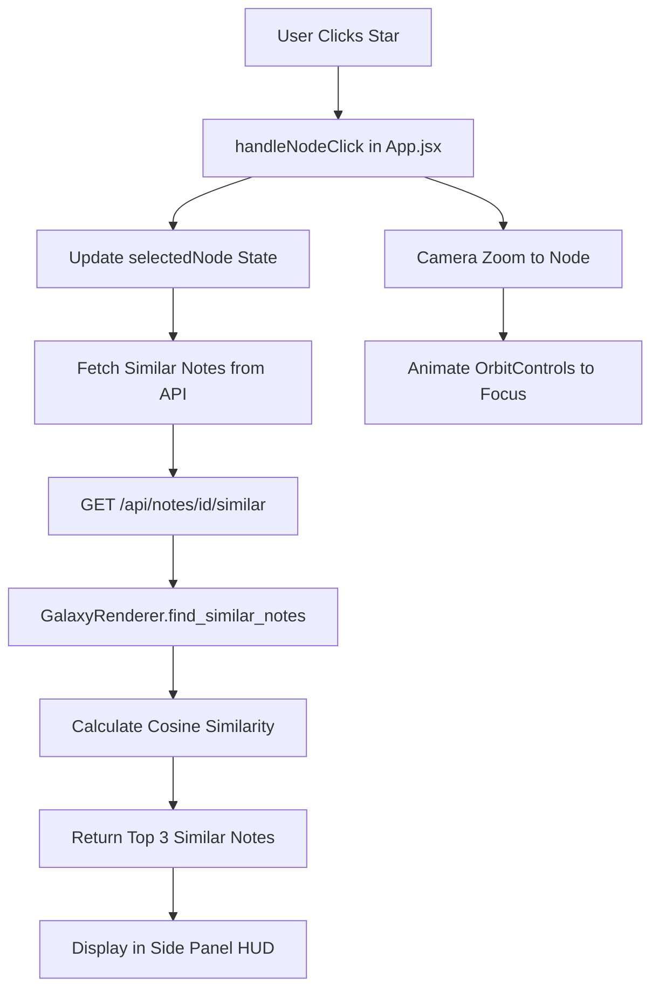

#Neural Inspector: Interactive UI Implementation

## Overview

Transform the app from a "museum" into an interactive tool by adding similarity search, a side panel HUD, and camera zoom functionality when clicking stars.

## Architecture Flow




## Implementation Tasks

### Task 1: Backend - Similarity Search Method

**File**: `backend/services/galaxy_brain.py`

- Add instance variable `self.embeddings_cache` to store embeddings after processing
- Update `process_notes()` to cache embeddings: `self.embeddings_cache = embeddings` after line 121
- Add new method `find_similar_notes(self, note_id: int, top_k=3)`:
- Validate `note_id` is within bounds
- Get target embedding from cache: `target_embedding = self.embeddings_cache[note_id]`
- Calculate cosine similarity between target and all other embeddings using `np.dot()` and `np.linalg.norm()`
- Exclude the target note itself from results
- Return top_k most similar notes as list of dicts with `id`, `label`, `similarity_score`, `category`, `cluster_label`

**Note**: If embeddings cache is empty (e.g., on first call), regenerate embeddings by calling `process_notes()` with loaded notes.

### Task 2: Backend - API Endpoint

**File**: `backend/api/routes.py`

- Add new endpoint `GET /api/notes/{note_id}/similar`:
- Extract `note_id` from path parameter (convert to int)
- Load notes from storage using `load_notes()`
- Ensure embeddings are available (call `galaxy_renderer.process_notes(notes)` if cache is empty)
- Call `galaxy_renderer.find_similar_notes(note_id, top_k=3)`
- Return JSON: `{"similar_notes": [{"id": ..., "label": ..., "similarity_score": ..., "category": ..., "cluster_label": ...}, ...]}`
- Handle errors: invalid note_id (404), missing embeddings (500)

### Task 3: Frontend - Side Panel HUD Component

**File**: `frontend/src/App.jsx`

- Add state for similar notes: `const [similarNotes, setSimilarNotes] = useState([])`
- Add state for loading: `const [loadingSimilar, setLoadingSimilar] = useState(false)`
- Update `handleNodeClick` to:
- Set `selectedNode`
- Fetch similar notes: `GET /api/notes/${node.id}/similar`
- Update `similarNotes` state with response
- Handle loading and error states
- Create side panel JSX structure (right side of screen):
- Position: `position: fixed, right: 0, top: 0, height: 100vh`
- Slide animation: `transform: translateX(${selectedNode ? '0' : '100%'})`
- Futuristic styling: dark background, neon borders, glassmorphism
- Display sections:
    - Note text (large, prominent)
    - Cluster name (with color indicator)
    - "Related Thoughts" section with list of similar notes
    - Each similar note shows: label, similarity score (as percentage), category badge

### Task 4: Frontend - Camera Zoom Animation

**File**: `frontend/src/components/Galaxy.jsx`

- Add `selectedNodeId` prop to `Galaxy` component
- Use `useThree()` hook to access camera and controls
- Add `useEffect` that watches `selectedNodeId`:
- When a node is selected, find its position in the nodes array
- Calculate target camera position (offset from node position)
- Use `gsap` or manual animation to smoothly move camera and update `controls.target`
- Alternative: Use `drei`'s `CameraControls` or manually animate `OrbitControls` ref
- Pass `selectedNode` from `App.jsx` to `Galaxy` component

### Task 5: Frontend - Styling for Side Panel

**File**: `frontend/src/App.css`

- Add `.side-panel` class with:
- Fixed positioning on right side
- Width: 400px (responsive)
- Dark background with gradient
- Slide-in animation (CSS transition or transform)
- Glassmorphism effect (backdrop-filter: blur)
- Neon border accents
- Add `.similar-note-item` for each related thought
- Add `.similarity-score` badge styling
- Ensure panel doesn't overlap with existing sidebar

## Technical Details

### Cosine Similarity Calculation

```python
def cosine_similarity(vec1, vec2):
    dot_product = np.dot(vec1, vec2)
    norm1 = np.linalg.norm(vec1)
    norm2 = np.linalg.norm(vec2)
    return dot_product / (norm1 * norm2) if (norm1 * norm2) > 0 else 0
```


### Camera Animation Approach

- Use React Three Fiber's `useFrame` to smoothly interpolate camera position
- Target position: `[node.x * scale + offset_x, node.y * scale + offset_y, node.z * scale + offset_z]`
- Use easing function for smooth animation (e.g., lerp with damping)

### API Response Format

```json
{
  "similar_notes": [
    {
      "id": 5,
      "label": "Note text...",
      "similarity_score": 0.87,
      "category": 2,
      "cluster_label": "Machine Learning"
    }
  ]
}
```


## Files to Modify

1. `backend/services/galaxy_brain.py` - Add embedding cache and similarity search
2. `backend/api/routes.py` - Add similarity endpoint
3. `frontend/src/App.jsx` - Add side panel, state management, API calls
4. `frontend/src/components/Galaxy.jsx` - Add camera zoom animation
5. `frontend/src/App.css` - Add side panel styling

## Dependencies

No new dependencies required. Uses existing:

- `numpy` for cosine similarity (already in requirements)